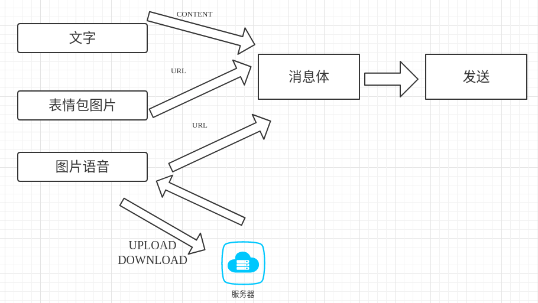
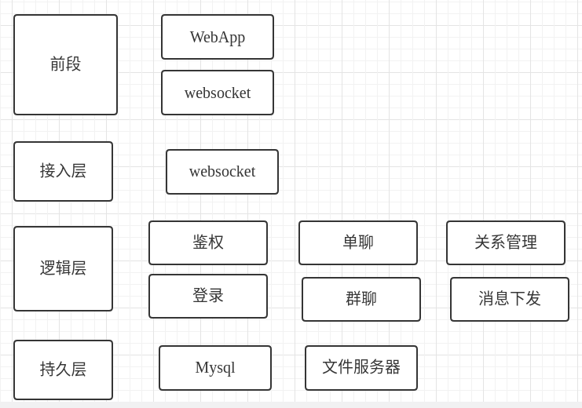
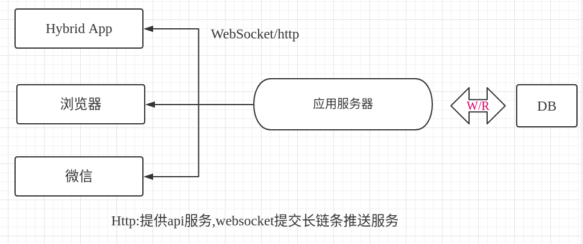

# MsgGO
Golang Instant Messaging System  
基于golang的分布式百万级即时通讯系统

#### 需求分析:
- 发送/接收
- 实现群聊
- 高并发=单机+分布式+弹性扩容

#### 需求拆分
- 实现简单功能 文字通讯
- 资源标准化编码
    - 资源采集并标准化,转换为content/url
    - 资源编码,最终目标拼接一个json消息体
- 消息体的可扩展性
    - 兼容基础媒介入图片文字语音(URL/PIC/CONTENT/NUM)
    - 能承接大量新业务,扩展不能对现有业务产生影响
    - 红包/打卡/签到等本质是消息内容不一样
- 群聊的特殊需求
    - 基础功能无区别
    - 1条消息多个参与群聊的终端及时接收到
    - 服务器流量计算
        - 服务器负载分析
            - A发送图片512K
            - 100人同时在线接收512kb*100=50M
        - 解决分析
            - 使用缩略图
            - 提供资源服务并发能力使用云服务(qos/alioss)
            - 使用压缩消息体,发送文件路径而不是整个文件
- 高并发
    - 单机并发性能最优
    - 海量用户分布式部署
    - 应对突发性事件弹性扩容 熔断 服务降级

// 消息体核心
``` 
type Message struct {
	Id int64 `json:"id,omitempty" form:"id"` //消息id
	Userid int64 `json:"userid,omitempty" form:"userid"`//发送用户
	Cmd int `json:"cmd,omitempty" form:"cmd"`//群聊还是私聊
	Dstid int64 `json:"dstid,omitempty" form:"dstid"` // 对端id or 群id
	Media int `json:"media,omitempty" form:"media"` //消息样式
	Content string `json:"content,omitempty" form:"content"` //消息内容
	Pic string `json:"pic,omitempty" form:"pic"` //预览图片
	Url string `json:"url,omitempty" form:"url"` //服务url
	Memo string `json:"memo,omitempty" form:"memo"` //简单描述
	Amount int `json:"amount,omitempty" form:"amount"` //和数字相关的
}    
```
### IM系统架构


#### 网络结构


#### 单机优化
- Map
    - 使用读写锁
    - map不要太大
- 或者使用syncMap 安全的map
- 优化最大文件数
- 降低对Cpu资源的使用
    - 降低Json编码频次
    - 一次编码多次使用
- 降低IO资源使用
    - 合并写数据库次数
    - 优化对数据库读操作
    - 能缓存就缓存
- 应用/资源服务分离
    - 系统提供动态服务
    - 文件服务迁移到oss